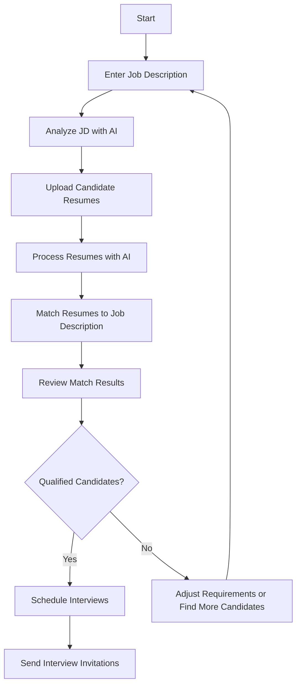
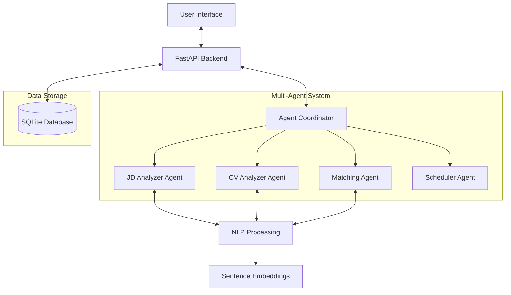

# Recruitly - AI-Powered Job Application Screening System

Recruitly is an end-to-end recruitment solution that uses AI to match job descriptions with candidate resumes through natural language processing and semantic similarity techniques. Developed by Advithiya Duddu and Aadi Joshi.

## Key Features

- **Job Description Analysis**: Extract structured information from job descriptions
- **Resume Processing**: Parse and analyze multiple PDF resumes
- **AI-Powered Matching**: Compare resumes against job requirements with semantic matching
- **Candidate Ranking**: Score and rank candidates based on qualification fit
- **Interview Scheduling**: Generate interview slots and send email invitations
- **Multi-Agent System**: Specialized AI agents handle different recruitment tasks

## User Flow



## System Architecture



## Tech Stack

- **Backend**
  - FastAPI (API framework)
  - NLTK & spaCy (Natural Language Processing)
  - Sentence Transformers (Semantic text embeddings)
  - SQLite (Database)

- **Frontend**
  - React (UI library)
  - Vite (Build tool)
  - Tailwind CSS (Styling)
  - Chart.js (Data visualization)
  - PDF.js (PDF processing)

- **Data Processing**
  - pdfplumber (Text extraction)
  - Cosine similarity (Matching algorithm)

## Installation and Setup

### Backend Setup

1. Install dependencies:
   ```
   cd backend
   pip install -r requirements.txt
   ```

2. Initialize the database:
   ```
   python -c "from app import init_db; init_db()"
   ```

3. Start the backend server:
   ```
   python app.py
   ```
   The server will run at `http://127.0.0.1:8000`

### Frontend Setup

1. Navigate to the frontend directory:
   ```
   cd frontend
   ```

2. Install dependencies:
   ```
   npm install
   ```

3. Start the development server:
   ```
   npm run dev
   ```
   The application will be available at `http://localhost:3000`

## Usage Guide

### Step 1: Job Description Analysis
1. Paste a job description in the text area
2. Click "Analyze Job Description"
3. Review the extracted job requirements, responsibilities, and qualifications

### Step 2: Resume Upload
1. Upload PDF resumes (drag and drop or select files)
2. Click "Process Resumes"
3. Wait while the system extracts and analyzes candidate information

### Step 3: Candidate Matching
1. Click "Start Matching Process"
2. Review candidate rankings and match scores
3. Expand candidate entries to see detailed section-by-section comparisons
4. Use visualization charts to understand match quality

### Step 4: Interview Scheduling
1. Click the calendar icon next to qualified candidates
2. Select interview date and time
3. Add optional notes
4. Send automated email invitations

## API Endpoints

| Endpoint | Method | Description |
|----------|--------|-------------|
| `/embed` | POST | Process job descriptions and generate embeddings |
| `/upload-resumes` | POST | Upload and process multiple PDF resumes |
| `/match` | POST | Match current job description with processed resumes |
| `/suggest-interview-times/{candidate_id}` | GET | Generate available interview slots |
| `/send-email` | POST | Send interview invitation to candidate |
| `/clear-session` | GET | Reset the current session data |

## Troubleshooting

- **PDF Processing Issues**: Ensure PDFs are not password-protected and have selectable text
- **Match Quality Problems**: Longer, more detailed job descriptions provide better matches
- **Backend Connection**: Verify the backend server is running and accessible
- **Resume Parsing**: Use standard formatting in resumes for best section detection

## Project Structure

- `/backend` - FastAPI server with AI/NLP utilities
  - `app.py` - Main server with API endpoints
  - `agent_framework.py` - Multi-agent system implementation
  - `jd_embedding_utils.py` - Job description parsing
  - `resume_embedding_utils.py` - Resume parsing
  - `matcher.py` - Matching algorithms
  
- `/frontend` - React application with workflow UI
  - `/src/components` - UI components
  - `/src/pages` - Main application pages

## Contributors

- Advithiya Duddu
- Aadi Joshi
